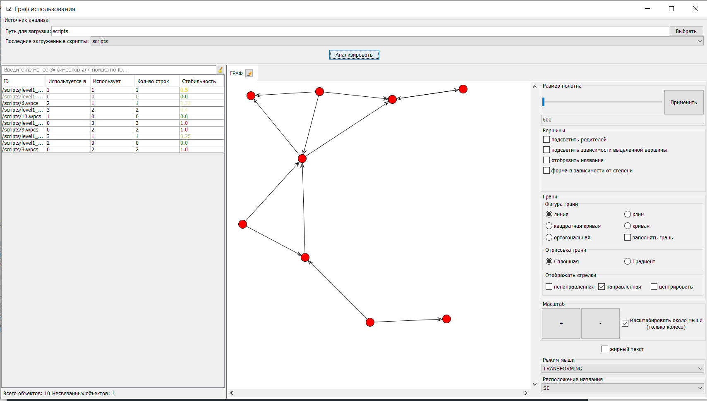

 # USAGE-GRAPH  
 Приложение для построения графов зависимостей.
 
 Используется библиотека [JUNG](http://jung.sourceforge.net/)
 
 Модули:
 * analyse-object-interface - интерфейс для реализации логики формирования объектов для построения графа  
 * analyse-script - реализация для построения графа из скрипта
 * swing-gui-source-analyse-plugin - интерфейс для подключения swing интерфейса
 * swing-gui-source-analyse-plugin-script - реализация swing интерфеса для загрузки скриптового графа
 * swing-gui - основной swing интерфейс для работы
 
 Сборка и запуск  
 * mvn clean package -P prod - собирает проект со сформированным файлом run.bat в режиме скрытой консоли
 * mvn clean package -P test - собирает проект со сформированным файлом run.bat в режиме отображения консоли
 
 Для работы приложения из папки **swing-gui/target** необходимы файлы:  
 * run.bat
 * usage-graph.jar
 * папка lib

 Тестовые скрипты лежат в корне проекта в папке **scripts** 
 
 